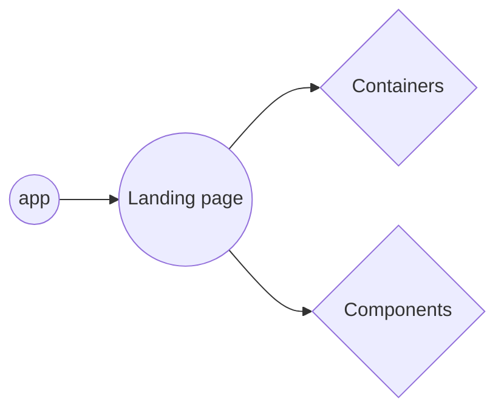

# TestTask for abz agency
## What i've used to make it ?

Project is made with react Js. 
Next packages were included into workflow:
 - redux
 - formik (In order to make easier register form validation)
 - node-sass
 - react-thunk (For async actions)

And some small packages besides them
##

*By Bilous Illia*